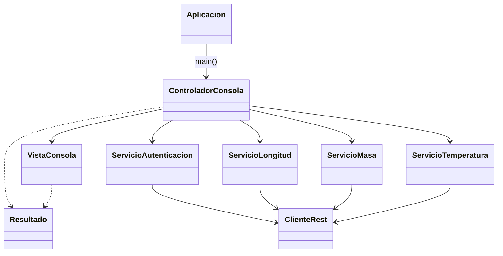
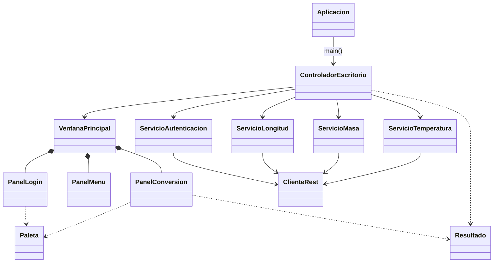
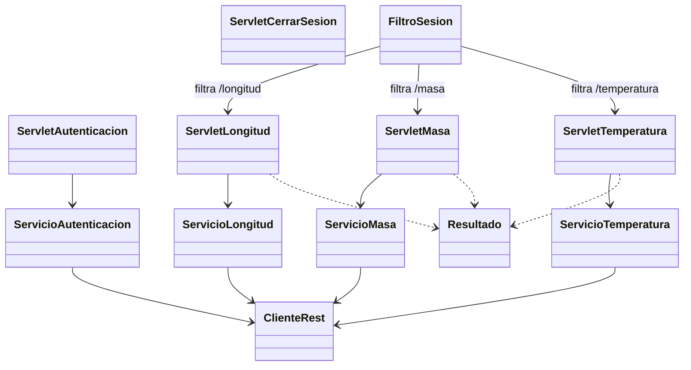
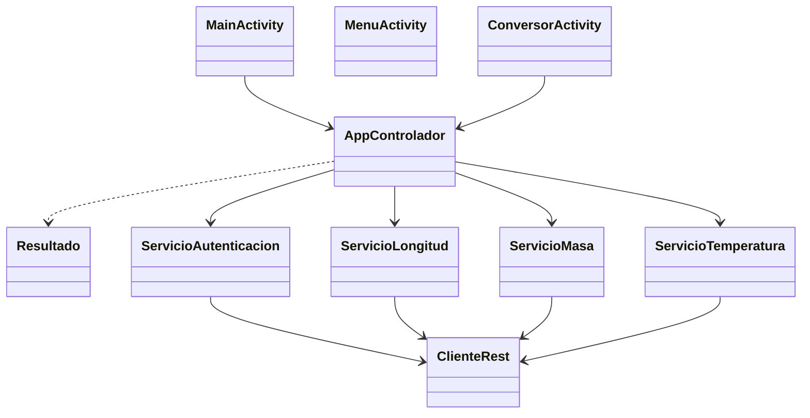
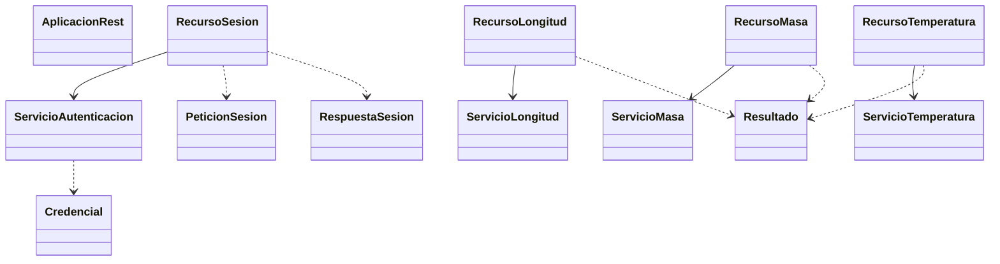

# CONVERSIÓN DE UNIDADES (CONUNI) — RESTful Java (GR06)

Repositorio de la Unidad 1. Contiene el servidor REST (JAX-RS/Jakarta) y cuatro clientes (consola, escritorio, web y móvil) que consumen la API.

## Estructura del repositorio

Carpetas principales:

1. **01. UML/**: artefactos de análisis y diseño (diagramas).
2. **04. CLICONSOLA/**: cliente de consola (Java + Ant/NetBeans).
3. **05. CLIESCRITORIO/**: cliente de escritorio (Java Swing + Ant/NetBeans).
4. **06. CLIWEB/**: cliente web (JSP/Servlets + Ant/NetBeans).
5. **07. CLIMOVIL/**: cliente móvil (Android + Gradle + Kotlin/Java).
6. **08. SERVIDOR/**: servidor REST (JAX-RS/Jakarta + Ant/NetBeans).
7. **09. DOCUMENTACIÓN/**: documentación adicional.

---

## 04. CLICONSOLA — `cliente_consola_restful_java_conuni_gr06`

### Estructura

```text
04. CLICONSOLA/cliente_consola_restful_java_conuni_gr06/
	build.xml
	manifest.mf
	nbproject/
	src/
		ec/edu/monster/
			Aplicacion.java
			controlador/
				ControladorConsola.java
			vista/
				VistaConsola.java
			modelo/
				ClienteRest.java
				Resultado.java
				ServicioAutenticacion.java
				ServicioLongitud.java
				ServicioMasa.java
				ServicioTemperatura.java
```

### Diagrama de clases (resumen)



---

## 05. CLIESCRITORIO — `cliente_escritorio_restful_java_conuni_gr06`

### Estructura

```text
05. CLIESCRITORIO/cliente_escritorio_restful_java_conuni_gr06/
	build.xml
	manifest.mf
	nbproject/
	src/
		ec/edu/monster/
			Aplicacion.java
			controlador/
				ControladorEscritorio.java
			modelo/
				ClienteRest.java
				Resultado.java
				ServicioAutenticacion.java
				ServicioLongitud.java
				ServicioMasa.java
				ServicioTemperatura.java
			vista/
				VentanaPrincipal.java
				PanelLogin.java
				PanelMenu.java
				PanelConversion.java
				Paleta.java
		img/
			(recursos de UI usados por PanelLogin)
```

### Diagrama de clases (resumen)



---

## 06. CLIWEB — `cliente_web_restful_java_conuni_gr06`

### Estructura

```text
06. CLIWEB/cliente_web_restful_java_conuni_gr06/
	build.xml
	nbproject/
	src/
		conf/
		java/
			ec/edu/monster/
				controlador/
					ServletAutenticacion.java
					ServletCerrarSesion.java
					ServletLongitud.java
					ServletMasa.java
					ServletTemperatura.java
				modelo/
					ClienteRest.java
					Resultado.java
					ServicioAutenticacion.java
					ServicioLongitud.java
					ServicioMasa.java
					ServicioTemperatura.java
				util/
					FiltroSesion.java
	web/
		index.jsp
		css/
		img/
		vista/
			iniciarSesion.jsp
			menu.jsp
			longitud.jsp
			masa.jsp
			temperatura.jsp
		WEB-INF/
```

### Diagrama de clases (resumen)



---

## 07. CLIMOVIL — `cliente_movil_restful_java_conuni_gr06`

### Estructura

```text
07. CLIMOVIL/cliente_movil_restful_java_conuni_gr06/
	build.gradle.kts
	settings.gradle.kts
	gradle.properties
	gradlew
	gradlew.bat
	app/
		src/
			main/
				AndroidManifest.xml
				java/
					ec/edu/monster/
						conuni/
							MainActivity.kt
							MenuActivity.kt
							ConversorActivity.kt
							ui/theme/
								Color.kt
								Theme.kt
								Type.kt
						controlador/
							AppControlador.java
						modelo/
							Resultado.java
						servicio/
							ServicioAutenticacion.java
							ServicioLongitud.java
							ServicioMasa.java
							ServicioTemperatura.java
						util/
							ClienteRest.java
				res/
					(recursos Android: drawables, strings, themes, etc.)
	gradle/
```

### Diagrama de clases (resumen)



---

## 08. SERVIDOR — `servidor_restful_java_conuni_gr06`

### Estructura

```text
08. SERVIDOR/servidor_restful_java_conuni_gr06/
	build.xml
	lib/
	nbproject/
	src/
		conf/
		java/
			ec/edu/monster/
				aplicacion/
					AplicacionRest.java
				controlador/
					RecursoSesion.java
					RecursoLongitud.java
					RecursoMasa.java
					RecursoTemperatura.java
				modelo/
					Credencial.java
					PeticionSesion.java
					RespuestaSesion.java
					Resultado.java
				servicio/
					ServicioAutenticacion.java
					ServicioLongitud.java
					ServicioMasa.java
					ServicioTemperatura.java
	test/
	web/
		index.html
		WEB-INF/
```

### Diagrama de clases (resumen)


